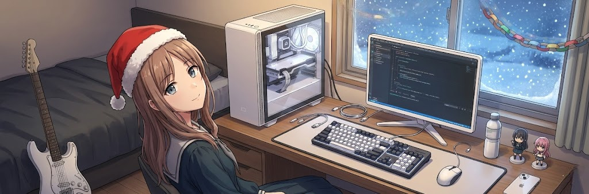

<!-- ================= БАНЕР ================= -->

  

 

<!-- ================= ЦЕНТРАЛЬНИЙ МОНОШРИФТ З Анімацією ================= -->

  

 

**━━━━━━━━━━━━━━━━━━━━━━━━━━━━━━━━━━━━━━━━━━━━━━━━━━━━━━━━━**

<!-- ================= ПРО МЕНЕ ================= -->
<h2 align="center">💥Про мене</h2>

Я — початківець у програмуванні, навчаюсь на <b>2 курсі Політехнічного фахового коледжу</b> за <b>121 спеціальністю</b>.  
Люблю кодити, експериментувати з технологіями та постійно вдосконалювати свої навички.

Маю практичний досвід у <b>C++</b>, <b>HTML</b>, <b>CSS</b>, <b>JavaScript</b>, а також працюю з базами даних <b>SQL</b> та <b>MongoDB</b>. Цікавлюсь кібербезпекою, апаратним забезпеченням та криптографією.

Також маю неймовірного кента — <b>Андрія</b>, з яким ми разом кодуємо та розвиваємо проєкти.

<!-- ================= БЕЙДЖІ ТА КНОПКА ================= -->

 

<h2 align="center">⚡Мій стек та інструменти</h2>

<!-- Мови програмування -->

 

<!-- Бази даних -->

 

<!-- Інструменти -->

 

<h2 align="center">🎇 Поточні проєкти</h2>

  
<strong>PolytechXXX</strong>

  <blockquote>
    Не було мені з Андрійом чим занятись. Пішли робити сайт для нашої групи, а точніше щоденник. "Палучілась хуйня".
  </blockquote>

  
<strong>Скоро буде...</strong>

  <blockquote>
    На канікулах попробую або сам або з кимось сайт зробити. Ще тему не придумав...
  </blockquote>

 

<h2 align="center">📊 Статистика GitHub</h2>

  

 

**━━━━━━━━━━━━━━━━━━━━━━━━━━━━━━━━━━━━━━━━━━━━━━━━━━━━━━━━━━━━**

<h2 align="center">👁‍🗨 Контакти</h2>

  <!-- TikTok -->
  

  <!-- Steam -->
  

  <!-- Discord -->
  

  <!-- Telegram -->
  

**━━━━━━━━━━━━━━━━━━━━━━━━━━━━━━━━━━━━━━━━━━━━━━━━━━━━━━━━━━━━**

  👋 Вітаю вас! Ви дійшли до кінця мого профілю.  
  Дякую за вашу увагу та час!  
  Сподіваюсь, вам сподобалось.

